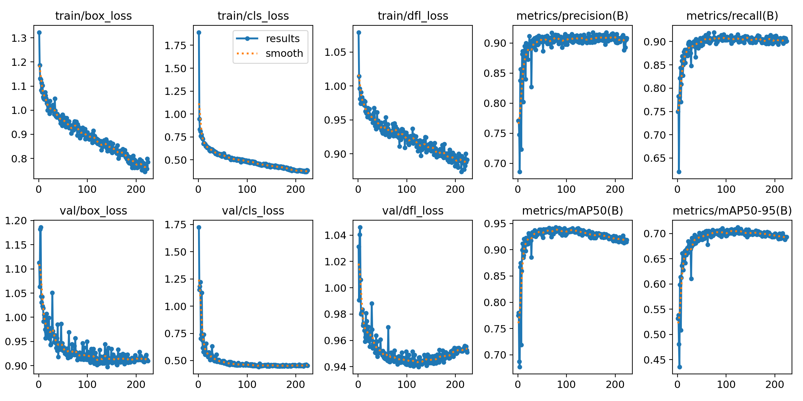
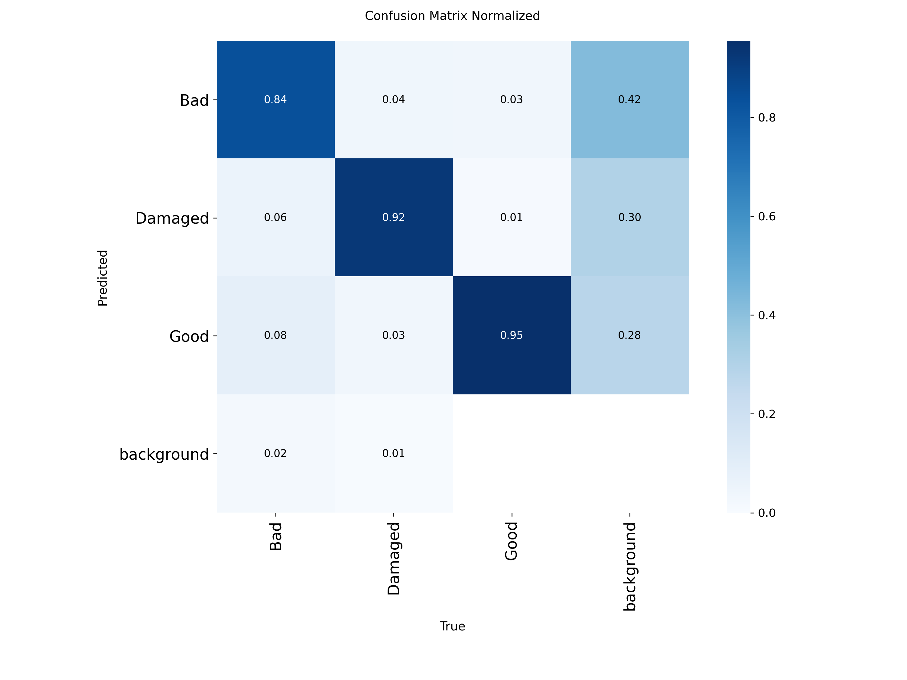
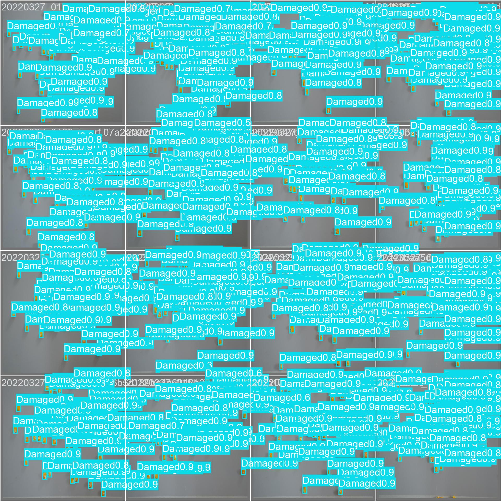

# 🌽 YOLOv8s for Automatic Corn Grain Quality Classification

<div align="center">


**Automatic Classification of Corn Grain Quality Using the YOLOv8s Deep Learning Architecture**

</div>

---

# 📖 Overview

This repository contains the source code, trained model, configuration files, and supplementary materials associated with the study:

> **Automatic Classification of Corn Grain Quality Using the YOLOv8s Deep Learning Architecture**

The proposed framework employs the **YOLOv8s** object detection architecture to automatically detect and classify corn kernels into three quality categories.

- 🌽 Good
- ⚠️ Damaged
- ❌ Bad

The workflow was implemented using **Google Colaboratory**, **PyTorch**, and the **Ultralytics YOLOv8** framework.

---

# 🖼 Graphical Abstract

<p align="center">

</p>

---

# 🔄 Workflow

```text
Corn Dataset
      │
      ▼
Image Preprocessing
      │
      ▼
Data Augmentation
      │
      ▼
Transfer Learning
      │
      ▼
YOLOv8s Training
      │
      ▼
Validation
      │
      ▼
Testing
      │
      ▼
Performance Evaluation
      │
      ▼
Automatic Corn Grain Quality Classification
```

---

# 📂 Repository Structure

```text
YOLOv8-Corn-Quality/

│
├── dataset/
│   └── data.yaml
│
├── notebooks/
│   └── YOLOv8_Training.ipynb
│
├── scripts/
│   ├── train.py
│   ├── predict.py
│   ├── evaluate.py
│   └── inference.py
│
├── weights/
│   └── best.pt
│
├── results/
│   ├── results.csv
│   ├── results.png
│   ├── confusion_matrix.png
│   ├── confusion_matrix_normalized.png
│   ├── PR_curve.png
│   ├── P_curve.png
│   ├── R_curve.png
│   ├── F1_curve.png
│   ├── labels.jpg
│   └── val_batch0_pred.jpg
│
├── figures/
│   ├── graphical_abstract.png
│   └── workflow.png
│
├── supplementary_material/
│   ├── Figure_S1.png
│   ├── Figure_S2.png
│   ├── Table_S1.pdf
│   └── Table_S2.pdf
│
├── requirements.txt
├── CITATION.cff
├── LICENSE
└── README.md
```

---

# 🌽 Dataset

| Item | Value |
|------|------:|
| Dataset | Corn Dataset |
| Platform | Roboflow Universe |
| Version | Corn-4 |
| Images | 621 |
| Annotated instances | 34,124 |
| Classes | 3 |

### Classes

- Good
- Damaged
- Bad

Dataset link

https://universe.roboflow.com/grad-jmjxr/corn-lycsy

License

CC BY 4.0

---

# 💻 Computational Environment

| Component | Specification |
|------------|---------------|
| Platform | Google Colaboratory |
| Python | 3.12.13 |
| Framework | Ultralytics 8.4.75 |
| Deep Learning | PyTorch 2.11.0 |
| CUDA | 12.8 |
| GPU | NVIDIA Tesla T4 (15 GB) |

---

# ⚙ Training Configuration

| Parameter | Value |
|------------|------:|
| Model | YOLOv8s |
| Input Size | 640 × 640 |
| Batch Size | 16 |
| Epochs | 300 |
| Early Stopping | 100 |
| Transfer Learning | COCO pretrained |

---

# 📈 Results

| Metric | Value |
|---------|------:|
| Precision | **90.6 %** |
| Recall | **91.7 %** |
| F1-score | **91.1 %** |
| mAP@0.50 | **94.1 %** |
| mAP@0.50:0.95 | **71.4 %** |

---

## Training Curves

<p align="center">

</p>

---

## Confusion Matrix

<p align="center">

</p>

---

## Precision–Recall Curve

<p align="center">

</p>

---

## Validation Examples

<p align="center">

</p>

---

# 🚀 Installation

Clone the repository

```bash
git clone https://github.com/Celsio-Assane/YOLOv8-Corn-Quality.git
```

Enter the project

```bash
cd YOLOv8-Corn-Quality
```

Install dependencies

```bash
pip install -r requirements.txt
```

---

# ▶ Training

```python
from ultralytics import YOLO

model = YOLO("yolov8s.pt")

model.train(
    data="dataset/data.yaml",
    epochs=300,
    imgsz=640,
    batch=16
)
```

---

# 🔍 Inference

```python
from ultralytics import YOLO

model = YOLO("weights/best.pt")

results = model.predict(
    source="image.jpg",
    conf=0.25,
    save=True
)
```

---

# 📄 Citation

If you use this repository, please cite:

```bibtex
@software{assane2026corn,
  author = {Célsio Assane},
  title = {YOLOv8-Corn-Quality},
  year = {2026},
  url = {https://github.com/Celsio-Assane/YOLOv8-Corn-Quality}
}
```

---

# 👨‍🔬 Authors

**Célsio Assane**

Federal Goiano Institute (IF Goiano)

Graduate Program in Agricultural Sciences (PPGCA)

Graduate Program in Applied Engineering and Sustainability (PPGEAS)

Brazil

ORCID:

https://orcid.org/0000-0002-3905-129X 
---

# 🙏 Acknowledgments

The authors acknowledge the support provided by:

- National Council for Scientific and Technological Development (CNPq)
- Coordination for the Improvement of Higher Education Personnel (CAPES)
- Federal Goiano Institute (IF Goiano)
- Graduate Program in Agricultural Sciences (PPGCA)
- Graduate Program in Applied Engineering and Sustainability (PPGEAS)

---

# 📜 License

This repository is distributed under the **MIT License**.

The **MIT License applies only to the source code** contained in this repository.

The **Corn Dataset** is distributed by **Roboflow Universe** under the **Creative Commons Attribution 4.0 (CC BY 4.0)** license.

---

# ⭐ Support

If you find this repository useful, please consider:

- ⭐ Starring this repository
- 📄 Citing the associated publication
- 🤝 Contributing with suggestions and improvements
- 🍴 Forking the project

---

<div align="center">

**Developed with ❤️ using YOLOv8, PyTorch and Google Colab**

</div>
...
